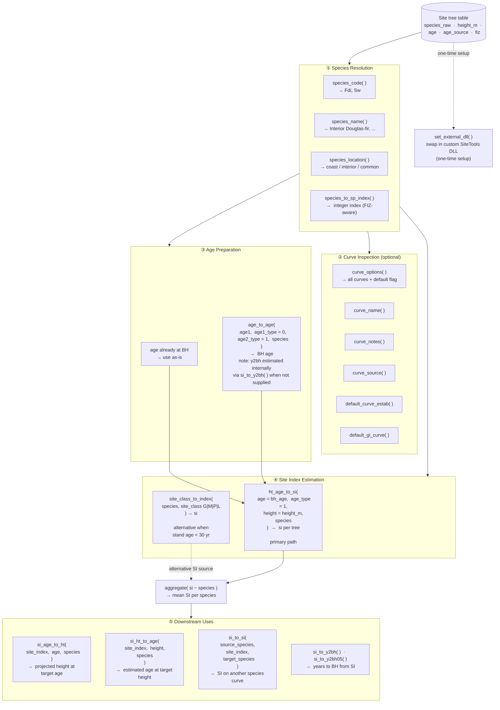

# BCsindexRCFS

BCsindexRCFS is a modernized fork of the original SIndexR package for running
Site index calculations in R, with a focus on practical forestry workflows.

## Project goals

BCsindexRCFS keeps compatibility with legacy SIndexR interfaces while adding a
cleaner modern wrapper layer that is easier to use in applied analysis and
data pipelines.

## Acknowledgements

- Yong Luo, original author of the SIndexR R package.
- Ken Polsson, original author/maintainer of the underlying Sindex C code.

## What has changed in this fork

- Added modern wrapper interfaces for core conversions (`ht_age_to_si`, `si_to_ht`,
    `si_ht_to_age`, `si_to_si`, `SC2SI`, `si_to_y2bh`, `si_to_y2bh05`).
- Added modern metadata aliases (`default_curve`, `species_code`,
    `species_name`).
- Added once-per-session legacy warnings for superseded conversion wrappers.
- Added workflow examples with generic data for:
    - Permanent Sample Plot (PSP) productivity estimation.
    - Treelist enrichment for growth-and-yield model inputs.
- Added migration and legacy reference documentation vignettes.

## Installation

### From GitHub:

```r
if (!requireNamespace("remotes", quietly = TRUE)) install.packages("remotes")
remotes::install_github("dfelixsattler/BCsindexRCFS", build_vignettes = TRUE)
```

### From local source checkout:

```r
if (!requireNamespace("remotes", quietly = TRUE)) install.packages("remotes")
remotes::install_local(".", build_vignettes = TRUE)
```

### Dependency management

R automatically installs all declared dependencies from DESCRIPTION:
- **Imports** (required): Rcpp, stats, utils, data.table
- **Suggests** (optional): testthat, knitr, rmarkdown

## Quick start

```r
library(BCsindexRCFS)

# Height -> Site index
ht_age_to_si(age = 50, age_type = 1, height = 30, species = "SW")

# Site index -> Height
si_to_ht(age = 50, age_type = 1, site_index = 30, species = "SW")

# Site index -> Age
si_ht_to_age(site_height = 30, age_type = 1, site_index = 30, species = "SW")
```

## Function map

The diagram below shows how BCsindexRCFS functions connect in a typical site productivity workflow, starting from a raw site tree table through to downstream growth model inputs.



For a full worked example that follows each phase of this diagram, see the `site-tree-workflow` vignette.

## Workflow examples

The best way to explore real forestry workflows is via the built-in vignettes.

**In RStudio:** go to the **Packages** pane → click **BCsindexRCFS** → click **User guides, package vignettes and other documentation**.

Or run:

```r
browseVignettes("BCsindexRCFS")
```

Three workflow vignettes are available:

| Vignette | Description |
|---|---|
| `site-tree-workflow` | Full API walkthrough: species resolution, age conversion, SI estimation, and downstream uses with a mixed-species site tree example |
| `workflow-integration` | PSP productivity estimation and treelist preparation for growth-and-yield models |
| `legacy-interfaces` | Migration guide from old SIndexR function names |

Open one directly:

```r
vignette("site-tree-workflow",   package = "BCsindexRCFS")
vignette("workflow-integration", package = "BCsindexRCFS")
vignette("legacy-interfaces",    package = "BCsindexRCFS")
```

> **Note:** vignettes are only available when the package is installed with
> `build_vignettes = TRUE` (see Installation above).

## External Sindex DLL

The package works standalone using its built-in C++ implementation. Optionally,
you can load the official Sindex DLL from the BC Government for bit-identical
results with SiteTools:

**Download:** [Sindex DLL v154 (BC Government)](https://www2.gov.bc.ca/assets/gov/farming-natural-resources-and-industry/forestry/stewardship/forest-analysis-inventory/software/sindex_dll_v154.zip)

```r
library(BCsindexRCFS)
set_external_dll("C:/path/to/sindex64.dll")
si_age_to_ht(species = "FDC", age = 50, site_index = 28)
clear_external_dll()
```

## Support and contribution

Please file issues and contributions in this fork repository. See
`CONTRIBUTING.md` and `CODE_OF_CONDUCT.md`.

## License

Apache License 2.0. See `LICENSE`.

